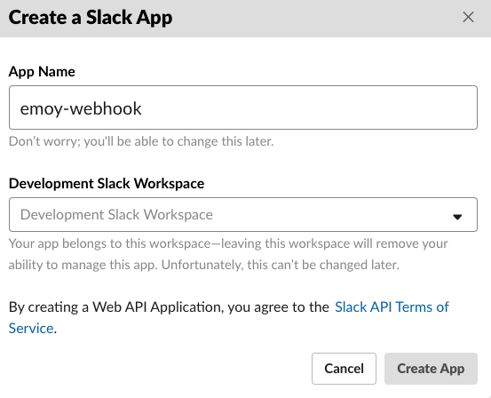
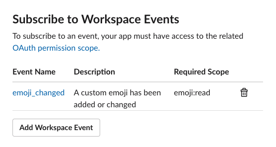

# Create Slack App
## 0. Preparation
* Create [Incoming webhook](https://slack.com/apps/A0F7XDUAZ)
* Deploy webhook to server

## 1. Go to https://api.slack.com/apps and click "Create New App"

## 2. Create a Slack app

## 3. Go to "Basic Information" and click "Event subscriptions"

## 4. Enable events

## 5. Register webhook URL

## 6. Register `emoji_changed` to Workspace events

and click save

## 7. Click "Install App to Workspace"

