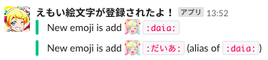

# emoy_webhook
emoy webhook (**Emo**ji notif**y** webhook) notify when new emoji is add

[](https://github.com/sue445/emoy_webhook/actions/workflows/test.yml)
[](https://github.com/sue445/emoy_webhook/actions/workflows/docker-ghcr.yml)
[](https://github.com/sue445/emoy_webhook/actions/workflows/docker-gcp.yml)
[](https://codeclimate.com/github/sue445/emoy_webhook/maintainability)
[](https://coveralls.io/github/sue445/emoy_webhook?branch=main)

## Example


## Requirements
* Slack app
  * see [CREATE_SLACK_APP.md](CREATE_SLACK_APP.md)
* Incoming webhook
  * https://slack.com/apps/A0F7XDUAZ
* redis (optional)

## Getting started
### Docker
This application is provided as a Docker image, so you can run it wherever you like.

#### Images
* [GitHub Container Registry](https://github.com/sue445/emoy_webhook/pkgs/container/emoy_webhook) **(Recommended)**
  * `ghcr.io/sue445/emoy_webhook:latest`: Use latest version
  * `ghcr.io/sue445/emoy_webhook:X.Y.Z`: Use specified version
* [Google Artifact Registry](https://console.cloud.google.com/artifacts/docker/emoy-webhook/asia/emoy-webhook/app): If you want to run this app on [Cloud Run](https://cloud.google.com/run), use this image
  * `asia-docker.pkg.dev/emoy-webhook/emoy-webhook/app:latest`: Use latest version
  * `asia-docker.pkg.dev/emoy-webhook/emoy-webhook/app:X.Y.Z`: Use specified version
  * `asia-docker.pkg.dev/emoy-webhook/emoy-webhook/app:edge`: The contents of the main branch are pushed to this tag

#### Available environment variables
* `SLACK_WEBHOOK_URL` **(Required)** : Incoming Webhook URL
* `PUMA_THREADS_MIN` : Puma minimum threads count. default is `0`
* `PUMA_THREADS_MAX` : Puma minimum threads count. default is `1` (to prevent duplicate posts to Slack)
* `PUMA_WORKERS` : Puma workers count. default is `0` (to prevent duplicate posts to Slack)
* `PUMA_PORT` : Puma port. default is `8080`
* `DEBUG_LOGGING` : If `true` is set, debug logs are output
* `SENTRY_DSN` : [Sentry](https://sentry.io) DSN. This variable is optional. If you want to use Sentry, please set DSN
* `REDIS_URL` : Redis URLfor notification caching (e.g. `redis://path-to-redis:6379`). See following section for details
* `FIRESTORE_COLLECTION` : Firestore collection name for notification caching (e.g. `emoy_webhook_cache`). See following section for details

### Notification caching
emoy_webhook has the following notification caching mechanism. These are optional, but it is recommended to set one of them

#### Redis
Set cache to Redis. If you use this, set `REDIS_URL` environment variable.

#### Firestore
Set cache to Firestore. If you use this, set `FIRESTORE_COLLECTION` environment variable.

To automatically delete the saved cache, please do the following.

##### gcloud
```bash
gcloud firestore fields ttls update expires_at --collection-group=${FIRESTORE_COLLECTION} --enable-ttl --async
```

c.f. https://cloud.google.com/firestore/docs/ttl#gcloud

##### Terraform
```tf
resource "google_firestore_field" "emoy_webhook_cache_expires_at" {
  collection = "emoy_webhook_cache"
  field      = "expires_at"

  # Enable TTL
  ttl_config {
  }
}
```

requires [terraform-provider-google](https://github.com/hashicorp/terraform-provider-google) 4.65.0+

c.f. https://registry.terraform.io/providers/hashicorp/google/latest/docs/resources/firestore_field#nested_ttl_config

### Heroku
This application was offered as a Heroku application, but [since Heroku is ending its free plan](https://blog.heroku.com/next-chapter), I have made it possible to run it outside of Heroku.

So this app can run outside of Heroku.

If you want to run this app on Heroku, browse [heroku branch](https://github.com/sue445/emoy_webhook/tree/heroku) and click "Deploy to Heroku" button.
